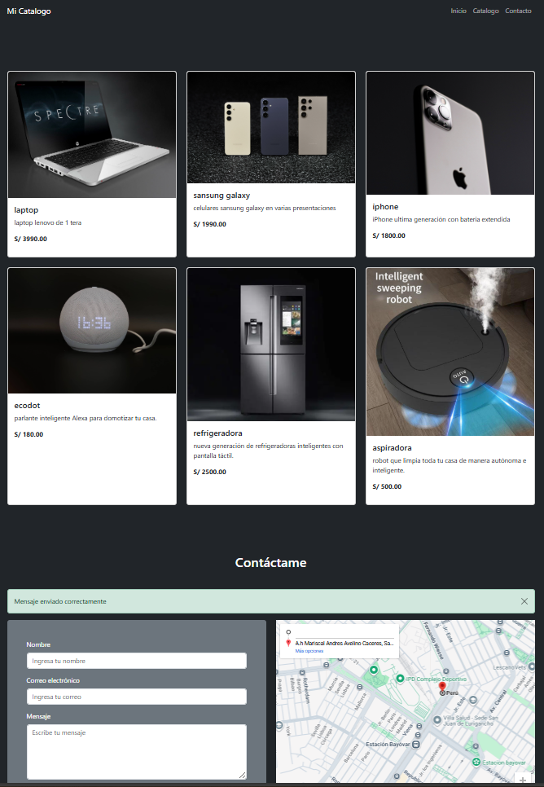

# Web Product Catalog

Catálogo de productos básico hecho con Django 5 y Bootstrap 5. Proyecto que permite agregar productos desde el panel admin de Django y ver los detalles de cada uno en la pagina, donde se podrá solicitar el producto.

## Vista previa



## Características

- Muestra un listado dinámico de productos.
- Tiene un botón de contacto por producto (puede dirigir a WhatsApp o formulario).
- Cuenta con un formulario de contacto con envío de correo a Gmail.
- tiene un mapa en google map donde esta ubicado la direccion exacta.
- El Backend desarrollado con Django 5.2.4

## 🛠️ Tecnologías utilizadas

- Python
- Django
- HTML5, CSS3
- Bootstrap
- SQLite3 (base de datos por defecto)
- Gmail SMTP (para envío de mensajes)

## ⚙️ Instalación

Sigue estos pasos para correr el proyecto en tu máquina local:


1. Clona el repositorio:
   ```bash
   git clone https://github.com/luisAngelDev/django-product-catalog.git
   cd product-catalog
   ```

2. Crea y activa un entorno virtual:S
   ```bash
   python -m venv venv
   venv\Scripts\activate  # En Windows
   ```

3. Instala las dependencias:
   ```bash
   pip install -r requirements.txt
   
   ```
4. Crea un archivo .env en la raíz del proyecto y agrega tus credenciales:

   ```bash
   EMAIL_HOST_USER=tuemail@gmail.com
   EMAIL_HOST_PASSWORD=tu_contraseña_de_aplicacion
   ```

5. Aplica las migraciones:
   ```bash
   python manage.py migrate
   ```

6. Inicia el servidor:
   ```bash
   python manage.py runserver
   ```

7. Accede al sitio en tu navegador:
   ```bash
   http://127.0.0.1:8000/
   ```

## 📬 Configuración del correo
Este proyecto usa contraseñas de aplicación de Gmail para enviar mensajes.

Debes:
- Activar la verificación en dos pasos en tu cuenta.
- Generar una contraseña de aplicación desde la configuración de seguridad de Google.
- Guardarla en .env (nunca subir este archivo a GitHub).

## 🔐 Acceso al panel de administración

Puedes acceder al panel de administración de Django en:

```
http://127.0.0.1:8000/admin
```

> ⚠️ Necesitas crear un superusuario:
> ```bash
> python manage.py createsuperuser
> ```

## 📂 Estructura del proyecto

```
product-catalog/
├── manage.py
├── catalog/              # App principal
│   ├── models.py
│   ├── views.py
│   ├── urls.py
│   └── templates/
├── static/               # Archivos estáticos
├── templates/            # Plantillas generales
├── venv/                 # Entorno virtual (ignorado por git)
├── .gitignore
├── README.md
├── requirements.txt
└── .env                  # Variables de entorno (ignorado por git)
```

## 👨‍💻 Autor

**Luis Ramos**  
[GitHub: @luisAngelDev](https://github.com/luisAngelDev) 

## 📄 Licencia
Este proyecto está bajo la Licencia MIT - consulta el archivo [LICENSE](./LICENSE) para más detalles.


